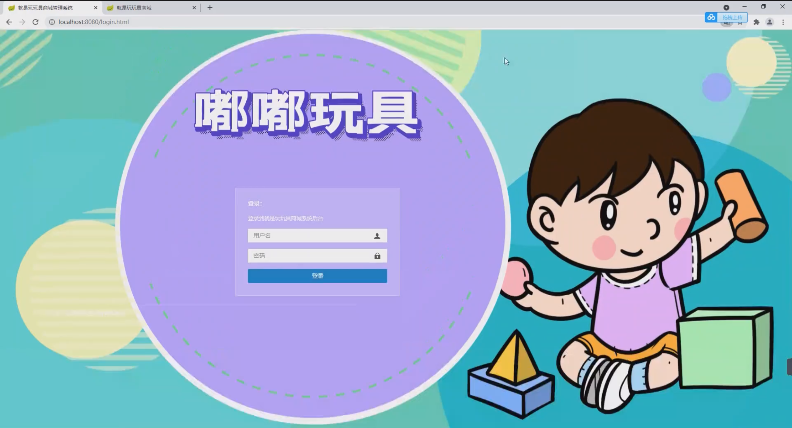
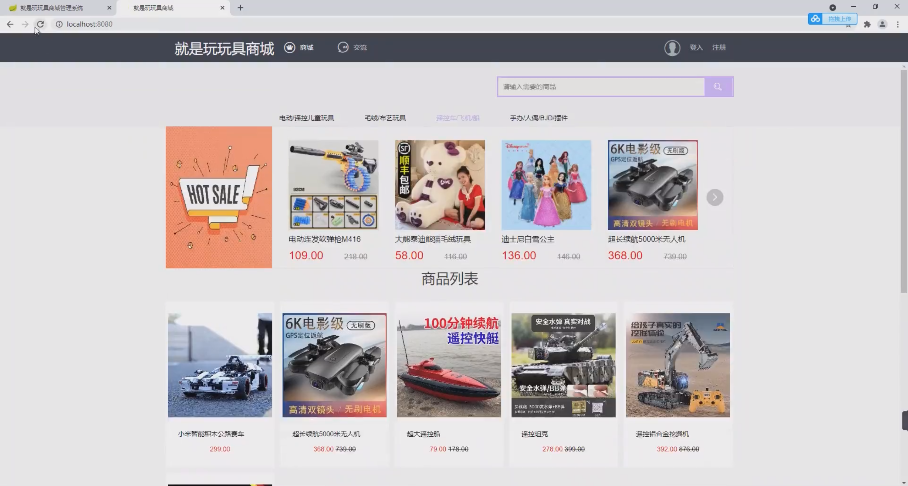
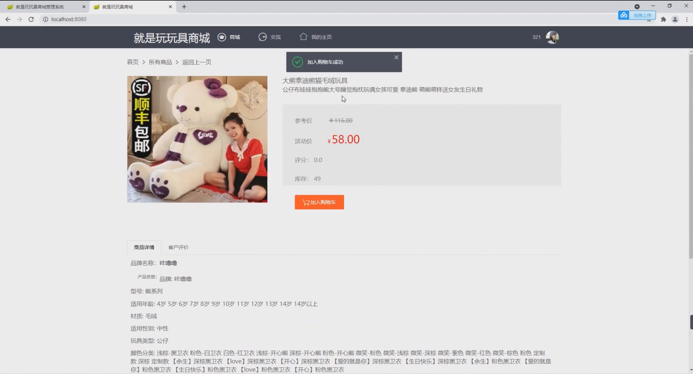
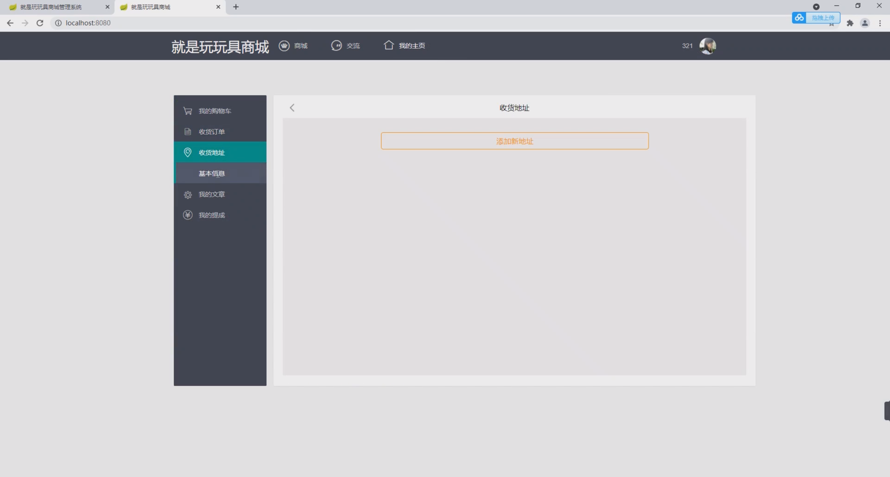
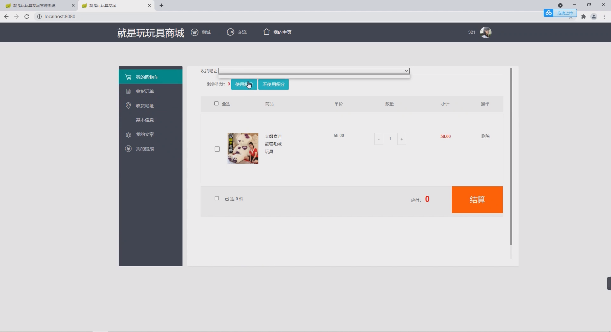
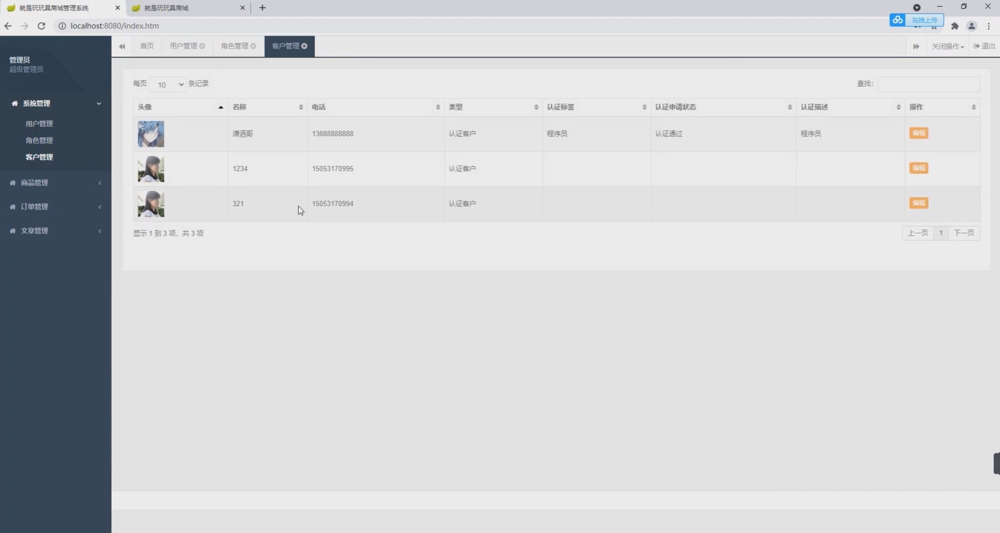

基于Springboot的玩具商城系统
=
### 完整代码获取地址：从戎源码网 ([https://armycodes.com/](https://armycodes.com/))
### 作者微信：19941326836  QQ：952045282 
### 承接计算机毕业设计、Java毕业设计、Python毕业设计、深度学习、机器学习
### 选题+开题报告+任务书+程序定制+安装调试+论文+答辩ppt 一条龙服务
### 所有选题地址https://github.com/nature924/allProject

一、项目介绍
---
基于Springboot框架实现的玩具商城系统包含两种角色：管理员、用户,系统分为前台和后台两大模块，主要功能如下。
### 【前台】：
1. 商城：用户可以浏览和搜索商品，查看商品详情，选择商品加入购物车，进行下单购买。
2. 交流：用户可以在论坛中与其他用户交流，发表帖子、评论和回复。
3. 我的主页：用户可以查看自己的个人信息，包括头像、昵称等，同时也可以查看自己的购物记录、订单状态等。
4. 我的购物车：用户可以管理购物车中的商品，包括添加、删除商品、修改商品数量等操作。
5. 收货订单：用户可以查看自己的订单列表，包括待付款、待发货、待收货和已完成的订单，可以查看订单详情、确认收货等。
6. 收货地址：用户可以管理自己的收货地址，包括添加、编辑、删除地址等操作。
7. 基本信息：用户可以管理自己的基本信息，包括修改密码、修改个人资料等。
8. 我的文章：用户可以发布和管理自己的文章，包括添加、编辑、删除文章等操作。
9. 我的提成：用户可以查看自己的提成情况，包括提成金额、提成历史等信息。

### 【后台】：
1. 系统管理：管理员可以管理系统的用户账号和权限，包括添加、编辑、删除用户，设置用户权限等。
2. 商品管理：管理员可以管理商品信息，包括添加、编辑、删除商品，设置商品属性、库存等。
3. 类型管理：管理员可以管理商品的类型信息，包括添加、编辑、删除类型，设置类型属性等。
4. 订单管理：管理员可以管理用户的订单，包括查看订单列表、修改订单状态等。
5. 文章管理：管理员可以管理用户的文章，包括查看文章列表、编辑、删除文章等操作。

二、项目技术
---
- 编程语言：Java
- 数据库：MySQL
- 项目管理工具：Maven
- 前端技术：VUE、HTML、Jquery、Bootstrap
- 后端技术：Spring、SpringMVC、MyBatis

三、运行环境
---
- 操作系统：Windows、macOS都可以
- JDK版本：JDK1.8以上都可以
- 开发工具：IDEA、Ecplise、Myecplise都可以
- 数据库: MySQL5.7以上都可以
- Tomcat：任意版本都可以
- Maven：任意版本都可以

四、运行截图
---

### 程序截图：

